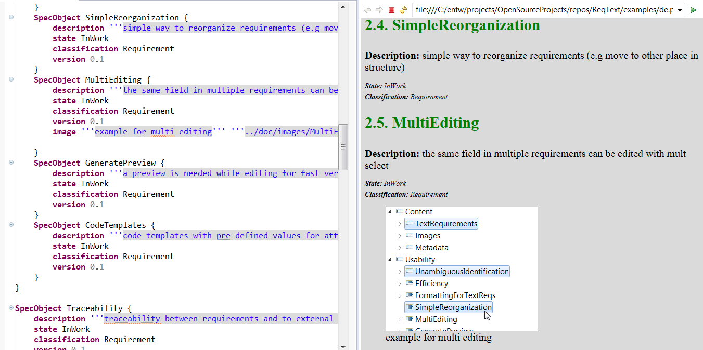
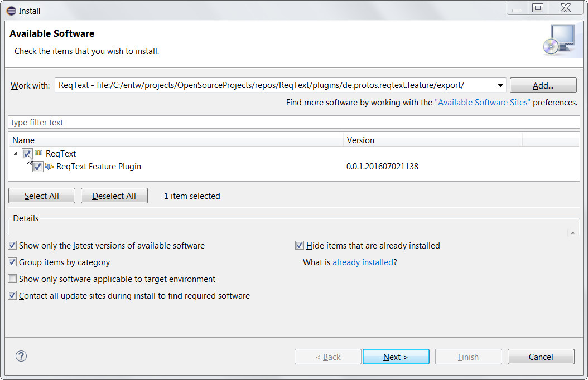
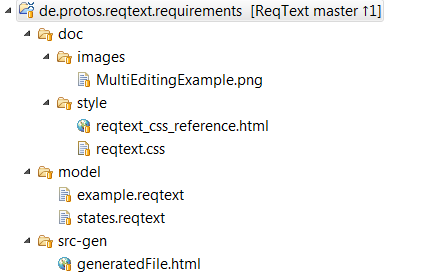
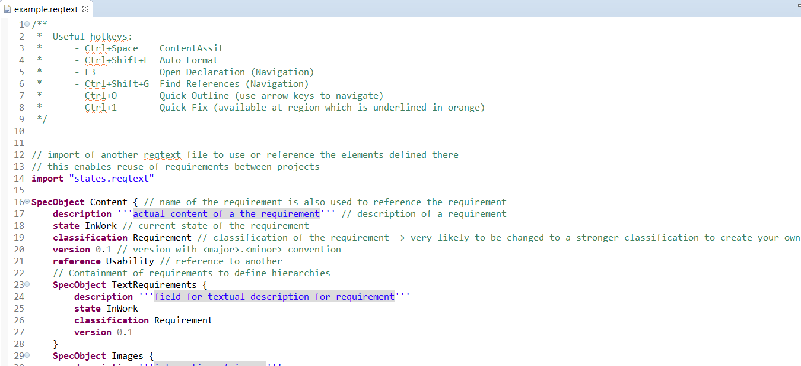

# Introduction
ReqText is a domainspecific language (DSL) for requirement engineering. 
The main goal is to provide a lightweight tooling for development, administration and documentation of requirements.

The biggest difference to most other tools is the use of a human readable language to edit and persist the requirements. 

This enables:

- simple version control (branches/diff/merge) with any version control system just like a piece of code (e.g. with GIT, Subversion, ...) - thus the requirements can be stored with the code

- powerful language editor with syntax highlighting, code templates and validation while you are typing

- reuse of requirements or other elements (like states, roles, ...) by building libraries

- variant handling of requirements with inheritance 

- simple integration of external documents or images that can be stored e.g. in the same repository

- easy integration with other tools or formats via eclipse extension points or simply by generating a text file

- simple implementation of your own document generators

**Requirement Source and Generated HTML Document**

# Getting Started
## Installation
1. Clone the ReqText project from [https://github.com/protossoftware/ReqText](https://github.com/protossoftware/ReqText "Github project ReqText")
2. Download an Eclipse Mars distribution and unpack it to your file system: [https://eclipse.org/downloads/packages/eclipse-ide-java-and-dsl-developers/mars2](https://eclipse.org/downloads/packages/eclipse-ide-java-and-dsl-developers/mars2 "Eclipse IDE for Java and DSL Developers (Mars SP2)")   
should also work with Eclipse Neon, but has only been tested with Mars
3. Start Eclipse and start update:   
In Eclipse: Help -> Install New Software -> Add (from local from &lt;ReqText GIT clone location&gt;\plugins\de.protos.reqtext.feature\export)
   
... and click through the usual "next" dialogs.

## Example Project ##
Import the example project into your workspace from &lt;ReqText GIT clone location&gt;\examples\de.protos.reqtext.requirements

Folders and Files:

* model : requirement models (.reqtext) - open with doubleclick and read the comments

* src-gen : the generated html output
* doc/images : the images referenced from the .reqtext files
* doc/style : the style sheet (.css) to format the html output (and a reference file to test it)

